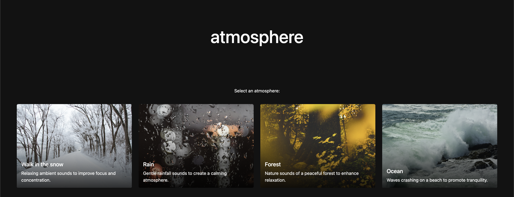
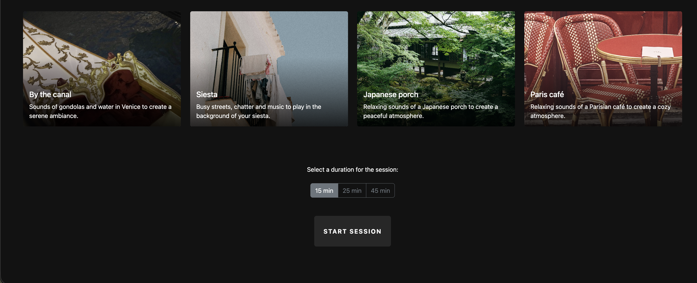

# Atmosphere

**Atmosphere** is an immersive productivity/relaxation web application designed with React. It blends ambient soundscapes with minimalist visual environments. 


## Core Feautres

- **Environment Selection:** 8 distinct atmospheres with visual cards and matching audio tracks.

- **Audio Integration:** Soundscapes managed via Web Audio API and React Hooks.

- **Dynamic Backgrounds:** Contextual UI that updates the viewport background based on the active session state.

- **Configurable Timer:** Preset focus blocks (15, 25, 45 min) with automated state reset upon completion.

- **Focus Mode:** Minimalist interface that toggles visibility of setup controls to reduce visual noise during sessions.


## Architecture and Design Patterns

The application is built using a **nested component structure**, allowing data to flow using `props` and `callbacks`. 

The project prioritizes **separation of concerns** and **clean code**:

* **`App.jsx`:** Serves as the single source of truth, manages the countdown timer, active session status, and global themes.
* **`AudioPlayer.jsx`:** Handles only audio effects, ensuring the sound persists correctly across UI re-renders.
* **`SetupView`** and **`FocusView`** are decoupled, stateless components that only handle UI rendering based on passed props.

### Component Tree
```text
src/
└── App.jsx (Central State & Logic)
    ├── AudioPlayer.jsx (Audio) 
    ├── SetupView.jsx (Conditional View: Setup Mode)
    │   ├── Header.jsx
    │   ├── Card.jsx (Reusable UI)
    │   └── TimerSelector.jsx
    └── FocusView.jsx (Conditional View: Focus Mode)
        └── TimerDisplay.jsx (Stateless Display)
```


## Visual Overview

### 1. Configuration Suite (Setup)
*Interface for environment selection and session duration.*





### 2. Immersive Focus Mode
*Visual feedback during an active session.*


## Technical Stack

- **Frontend:** React.js 
- **Styling:** Bootstrap 5.3 & CSS
- **Audio:** Native HTML5 Audio API via `useRef` for persistent playback
- **State Management:** Lifting State Up pattern for cross-component synchronization


## Installation & Deployment

Follow these steps to set up the development environment:

1. **Clone the repository:**
   ```bash
   git clone [https://github.com/your-username/atmosphere.git](https://github.com/your-username/atmosphere.git)
    ````

2. **Install Dependencies:**
   ```bash
   cd atmosphere
   npm install
   ````

3. **Run the server:**
   ````
   npm run dev
   `````

4. **Build for production:**
   ````
   npm run build
   ````

## Author

**Andrea Rodríguez**
*Full Stack Developer in Training*

- **GitHub:** [@anrodriguezsanz](https://github.com/anrodriguezsanz)
- **LinkedIn:** [in/andrea-rodríguez-sanz](www.linkedin.com/in/andrea-rodríguez-sanz)

